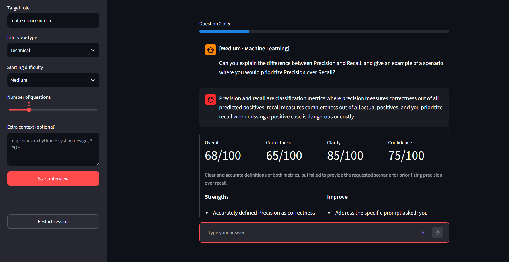
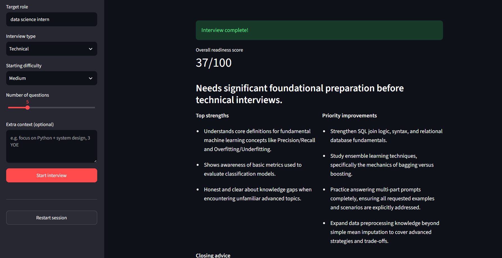
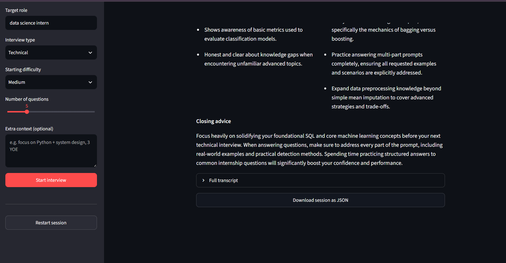

#  AI Interview Coach

A mock-interview chatbot that asks role-specific questions, scores your
spoken/written answers on correctness, clarity, and confidence, adapts
difficulty as you go, and closes with a downloadable readiness report.

Built as a portfolio/mini-project with a genuinely useful architecture,
not just a Q&A wrapper around an LLM.

SCREENSHOTS OF THE PROJECT:

Image 1-


Image 2-


Image 3-


## Features

- Adaptive AI interview questions
- Multiple interview modes (Technical, HR, System Design, Mixed)
- Dynamic difficulty adjustment
- Structured AI evaluation
- Multi-dimensional scoring (Correctness, Clarity, Confidence)
- Session transcript generation
- Downloadable JSON interview report
- LangGraph-based workflow orchestration
- Gemini structured outputs with Pydantic validation

## Tech Stack

| Technology | Purpose |
|------------|---------|
| Python | Core application |
| Streamlit | User Interface |
| Google Gemini API | Question generation & evaluation |
| LangGraph | Workflow orchestration |
| Pydantic | Structured AI outputs |
| python-dotenv | Configuration |

## How it works

```
src/
├── config.py         # env vars / settings (API key, model name)
├── models.py          # Pydantic schemas: Question, Feedback, Summary, State
├── prompts.py          # prompt templates sent to Gemini
├── gemini_client.py    # thin wrapper that asks Gemini for structured JSON
└── graph.py             # LangGraph state machine wiring it all together
app.py                    # Streamlit chat UI
```

**The graph.** Each user turn invokes a small LangGraph state machine:

```
START ──▶ (no answer yet?) ──▶ generate_question ──▶ END
      └─▶ (answer submitted) ─▶ evaluate_answer ──▶ adjust difficulty
                                        │
                             more questions left? ──▶ generate_question ──▶ END
                                        │
                                   session done ──▶ generate_summary ──▶ END
```

Gemini is only ever asked to return JSON matching a Pydantic schema
(`GeneratedQuestion`, `AnswerFeedback`, `SessionSummary`), so the app never
has to regex-parse a chat response — it gets typed, validated objects back.

**Adaptive difficulty.** A strong answer (score ≥ 75) bumps difficulty up
one notch for the next question; a weak one (score ≤ 40) eases it back down.
This is what makes it feel like a real interviewer rather than a static quiz.

## Setup

1. **Install dependencies**

   ```bash
   pip install -r requirements.txt
   ```

2. **Add your Gemini API key**

   Copy `.env.example` to `.env` and paste in a real key from
   [Google AI Studio](https://aistudio.google.com/apikey):

   ```bash
   cp .env .env
   ```

   ```
   GEMINI_API_KEY=your_api_key_here
   ```

   The model is configured as `gemini-flash-latest` (an alias, not a pinned
   version) so the project keeps working without edits as Google ships new
   Gemini versions. Override `GEMINI_MODEL` in `.env` if you ever want to
   pin a specific model id.

3. **Run it**

   ```bash
   streamlit run app.py
   ```

   Open the local URL Streamlit prints (usually `http://localhost:8501`).

## Using it

1. In the sidebar, set your target role, interview type (Technical, HR/
   Behavioral, System Design, or Mixed), starting difficulty, and number of
   questions.
2. Click **Start interview** — the first question appears as a chat message.
3. Type your answer in the chat box. You'll immediately get scored feedback
   (correctness / clarity / confidence, strengths, improvements, and a tip).
4. After the last question, you'll get an overall readiness score, top
   strengths, priority improvements, and closing advice — plus a **Download
   session as JSON** button to keep the transcript.

## Notes on the tech stack

- **Streamlit** for the frontend — fastest way to get a usable chat UI.
- **LangGraph** for orchestration — a genuine state machine (question →
  evaluate → adapt difficulty → next/finish), not just a for-loop, which is
  a better demo of understanding agentic workflows than a plain chat loop.
- **Pydantic** for every AI-facing data structure, enforced via Gemini's
  structured output mode (`response_schema`).
- **python-dotenv** for local config; nothing sensitive is hard-coded.
- `requirements.txt` uses `>=` version bounds on purpose, and the model name
  uses the `-latest` alias, so this project doesn't rot from version pinning
  issues — the tradeoff being behavior can shift slightly as Google updates
  the underlying model, which is fine for a demo project.
